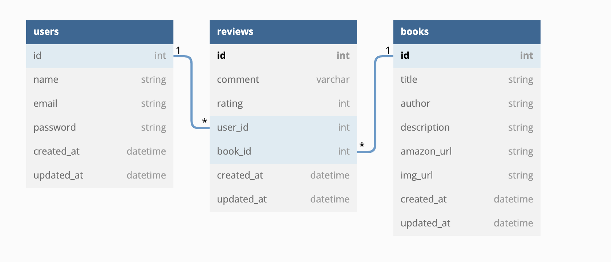

# README

Phase 4 Project

Created by: Joey Faris

This project will be created as a social media platform for book reviewing purposes. The main goals of the project are as follows:

MVP: As a user, I can:
 • Log into website with name, email, and password credentials.
 • View a list of cards that will show book information (Title, author, description, photo, and amazon link)
 • Add your own book with all of the book information to the site.
 • Write and delete a review and comment for each book on the website.
 
The front end development of this project will consist of React.js for the functionality and CSS/Tailwind CSS for the appearance.

All backend development will be created using Ruby on Rails. I will be creating a custom API with the following models and tables:

# Tables:

Thank you.
